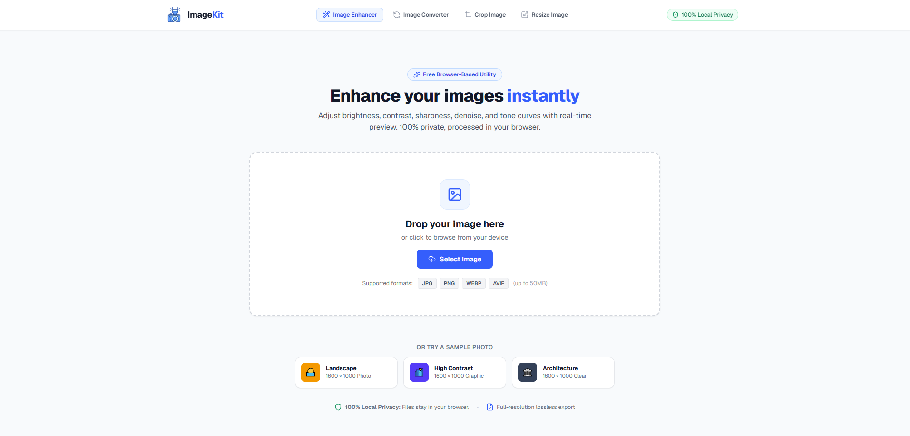
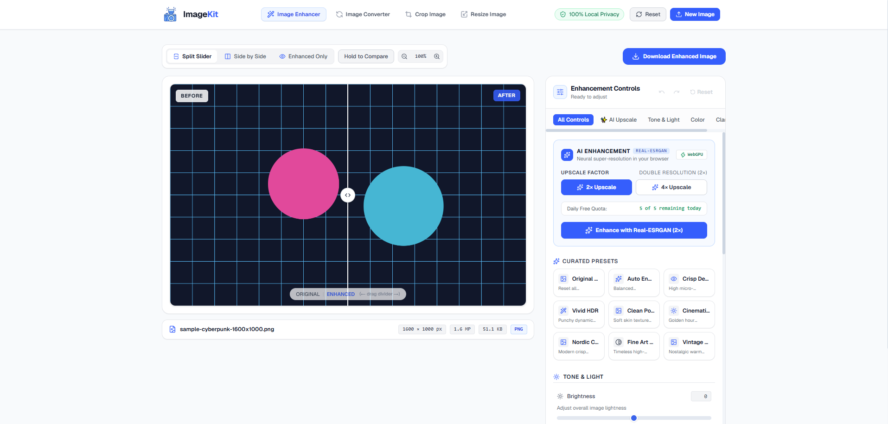
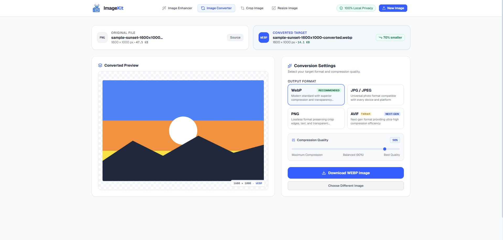
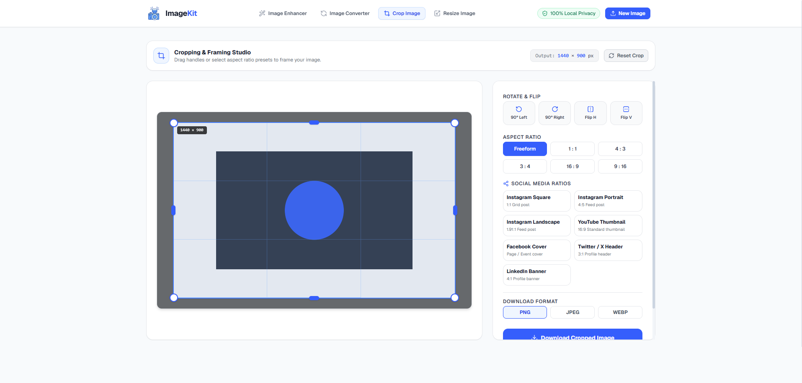
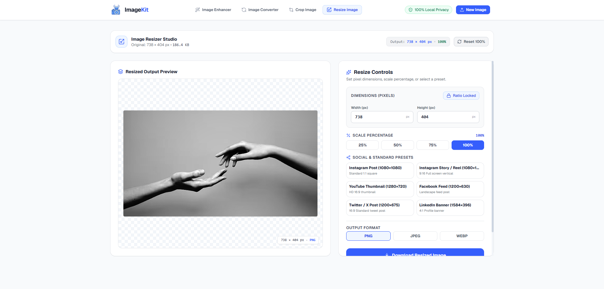

# ImageKit

> A fast, privacy-first image toolkit that lets you enhance, convert, crop, resize, and upscale images directly in your browser.

ImageKit is a browser-based image processing toolkit built with modern web technologies. It provides common image editing and optimization tools without requiring users to upload their images to a server.

**Your images stay on your device.**

---

## ✨ Features

### 🖼️ Image Enhancer

Enhance images directly in the browser with real-time controls.

* Brightness
* Contrast
* Saturation
* Sharpness
* Denoise
* Real-time preview
* Before/after comparison slider
* Reset adjustments
* Download enhanced image
* Browser-based processing

### 🤖 AI Image Enhancement

ImageKit also supports AI-powered image enhancement using **Real-ESRGAN**.

* AI image upscaling
* 2× / 4× enhancement where supported
* Runs locally in the browser
* WebGPU acceleration when available
* WASM/CPU fallback where necessary
* Tiled processing for larger images
* Loading/progress states
* Client-side daily usage limit

> AI enhancement is limited to **5 enhancements per day per browser/device storage profile**.

### 🔄 Image Converter

Convert images between common formats.

Supported formats:

* JPG / JPEG
* PNG
* WebP
* AVIF

Features:

* Format selection
* Quality control where supported
* Preview converted image
* Download converted image
* Browser-only conversion

### ✂️ Image Cropper

Crop images with an interactive editor.

Features:

* Free-form cropping
* Move crop area
* Resize crop area
* Aspect ratio presets
* 1:1
* 4:3
* 3:4
* 16:9
* 9:16
* Rotate
* Flip horizontally
* Flip vertically
* Touch and mouse support
* Download cropped image

### 📐 Image Resizer

Resize images while maintaining control over their dimensions.

Features:

* Custom width
* Custom height
* Aspect ratio locking
* Percentage-based resizing
* Preset dimensions
* Live preview
* Download resized image

---

## 🔒 Privacy First

ImageKit is designed around a **local-first architecture**.

Images are processed directly inside the user's browser using browser APIs and client-side processing libraries.

### Your image is not uploaded to our server.

This means:

* No image uploads
* No image storage
* No cloud processing
* No external image-processing API
* No account required for basic tools

Your files remain on your device during processing.

> **Note:** AI enhancement also follows the browser-only architecture. The model runs locally rather than sending the image to a remote AI API.

---

## 📸 Screenshots

### Homepage




---

### Image Enhancer




---

### Image Converter




---

### Image Cropper




---

### Image Resizer




---

## 🏗️ Tech Stack

ImageKit is built using modern frontend technologies.

| Technology           | Purpose                                       |
| -------------------- | --------------------------------------------- |
| **Next.js**          | Application framework                         |
| **React**            | User interface                                |
| **TypeScript**       | Type-safe development                         |
| **Tailwind CSS**     | Styling and responsive UI                     |
| **Canvas API**       | Client-side image processing                  |
| **Web APIs**         | File, Blob, Image, URL processing             |
| **ONNX Runtime Web** | Browser-based AI inference                    |
| **Real-ESRGAN**      | AI image enhancement                          |
| **WebGPU**           | Hardware-accelerated inference when supported |

---

## 🧠 Architecture

ImageKit follows a modular architecture so individual tools can evolve independently.

```text
ImageKit
│
├── UI
│   ├── Header
│   ├── Footer
│   ├── Upload / Dropzone
│   ├── Image Preview
│   └── Tool Controls
│
├── Image Tools
│   ├── Enhancer
│   ├── Converter
│   ├── Cropper
│   └── Resizer
│
├── AI
│   └── Real-ESRGAN
│
└── Image Processing
    ├── Filters
    ├── Sharpening
    ├── Denoising
    ├── Cropping
    ├── Resizing
    ├── Conversion
    └── Export
```

The processing layer is separated from the UI so that new processing technologies can be introduced without rewriting the interface.

---

## ⚡ Browser-Based Processing

The core image-processing pipeline uses browser capabilities such as:

```text
User selects image
        ↓
File API
        ↓
Browser memory
        ↓
Canvas / Image Processing
        ↓
Processed Image
        ↓
Blob
        ↓
Local Download
```

No server-side image processing is required for the core tools.

---

## 🤖 AI Enhancement Architecture

The AI enhancement pipeline uses a browser-compatible version of the Real-ESRGAN model.

```text
Input Image
     ↓
Image preprocessing
     ↓
Real-ESRGAN
     ↓
WebGPU / WASM
     ↓
Image reconstruction
     ↓
Output Image
     ↓
Before / After Preview
     ↓
Local Download
```

### Execution Provider

ImageKit prefers hardware acceleration when available:

```text
WebGPU available?
       │
      Yes
       ↓
   WebGPU inference
       │
      No
       ↓
 WASM / CPU fallback
```

Some model operations may still be assigned to the CPU even when WebGPU is active. This can be expected for certain shape or utility operations.

---

## 🚦 AI Usage Limit

To prevent excessive local resource consumption, AI enhancement has a client-side daily limit.

### Limit

**5 AI enhancements per day**

The counter:

* Is stored locally
* Resets on a new calendar day
* Applies only to AI enhancement
* Does not affect crop, resize, convert, or standard enhancement tools

Example:

```text
AI Enhancements

Used today: 2 / 5
Remaining: 3
```

### Important limitation

Because the limit is implemented on the client side, it is **not a security mechanism**.

A technically knowledgeable user can bypass the limit by clearing local browser storage or using another browser/device.

The limit exists primarily to control normal usage and reduce unnecessary browser-side GPU/CPU load.

---

## 📁 Project Structure

The exact structure may evolve as the project grows, but the application follows a modular organization similar to:

```text
imagekit/
│
├── app/
│   ├── enhance/
│   ├── convert/
│   ├── crop/
│   ├── resize/
│   └── ...
│
├── components/
│   ├── ImageUploader.tsx
│   ├── ImagePreview.tsx
│   ├── BeforeAfterSlider.tsx
│   ├── EnhancementControls.tsx
│   ├── DownloadButton.tsx
│   ├── Header.tsx
│   └── Footer.tsx
│
├── lib/
│   └── image/
│       ├── processing.ts
│       ├── filters.ts
│       ├── sharpen.ts
│       ├── denoise.ts
│       ├── export.ts
│       └── ai/
│           └── ...
│
├── public/
│   └── ...
│
├── screenshots/
│   ├── homepage.png
│   ├── enhancer.png
│   ├── ai-enhancement.png
│   ├── converter.png
│   ├── cropper.png
│   └── resizer.png
│
├── package.json
├── next.config.ts
├── tsconfig.json
└── README.md
```

---

## 🚀 Getting Started

### Prerequisites

Make sure you have installed:

* Node.js
* npm

Check your versions:

```bash
node -v
npm -v
```

### Clone the repository

```bash
git clone https://github.com/YOUR_USERNAME/imagekit.git
cd imagekit
```

### Install dependencies

```bash
npm install
```

### Run the development server

```bash
npm run dev
```

Open:

```text
http://localhost:3000
```

---

## 🏭 Production Build

Create an optimized production build:

```bash
npm run build
```

Then start the production server:

```bash
npm start
```

---

## 🌐 Deployment

ImageKit can be deployed to modern frontend hosting platforms such as Vercel.

Because the core image-processing functionality runs inside the browser, the application does not require a dedicated image-processing backend.

Typical deployment flow:

```text
GitHub
   ↓
Vercel
   ↓
Next.js Application
   ↓
User Browser
   ↓
Local Image Processing
```

---

## 📱 Responsive Design

ImageKit is designed to work across:

* Desktop
* Laptop
* Tablet
* Mobile

The interface adapts the tool controls and image preview depending on the available screen size.

Special attention is given to:

* Touch interaction
* Drag and drop
* Image preview sizing
* Before/after comparison
* Tool controls
* Mobile navigation
* Download actions

---

## 🎯 Project Goals

The project is built around several goals:

### 1. Privacy

Users should be able to edit images without uploading personal files to an external server.

### 2. Speed

Processing should happen locally whenever practical, reducing upload and download delays.

### 3. Simplicity

Each tool should perform one job clearly without unnecessary complexity.

### 4. Accessibility

The tools should be usable on both desktop and mobile devices.

### 5. Extensibility

The architecture should make it easy to add new image-processing capabilities in the future.

---

## 🛠️ Planned Improvements

Possible future features include:

* More AI enhancement models
* Background removal
* Image compression
* Image metadata viewer/remover
* Batch image processing
* More export formats
* Additional crop presets
* More resize presets
* WebGPU optimizations
* Improved large-image processing
* Offline/PWA support
* Additional image filters
* Image comparison tools

---

## ⚠️ Limitations

Because ImageKit performs processing in the browser, performance depends on the user's device.

Large images may require significant:

* RAM
* CPU
* GPU memory
* Browser resources

AI enhancement using Real-ESRGAN is particularly resource-intensive.

Older or low-powered devices may experience slower processing.

WebGPU availability also depends on the user's browser, operating system, hardware, and drivers.

---

## 🔐 Security & Privacy Considerations

ImageKit intentionally avoids uploading image files to a backend.

The application does not require image storage for its core functionality.

However, browser-based processing means that users should still use trusted browsers and keep their systems updated.

The client-side AI usage limit should also not be considered a security boundary.

---

## 🤝 Contributing

Contributions, suggestions, and improvements are welcome.

If you would like to contribute:

1. Fork the repository.
2. Create a feature branch.

```bash
git checkout -b feature/my-feature
```

3. Make your changes.
4. Test the application.
5. Commit your changes.

```bash
git commit -m "Add my feature"
```

6. Push the branch.

```bash
git push origin feature/my-feature
```

7. Open a Pull Request.

---

## 📄 License

This project is currently available for personal and educational use.

A formal open-source license can be added here when the project's licensing terms are finalized.

---

## 👨‍💻 Author

**Sadab Kibria**

Frontend Developer focused on building modern, useful web applications.

---

## ⭐ Support

If you find ImageKit useful, consider giving the repository a ⭐ on GitHub.

---

**ImageKit — Simple image tools. Private by design.**
